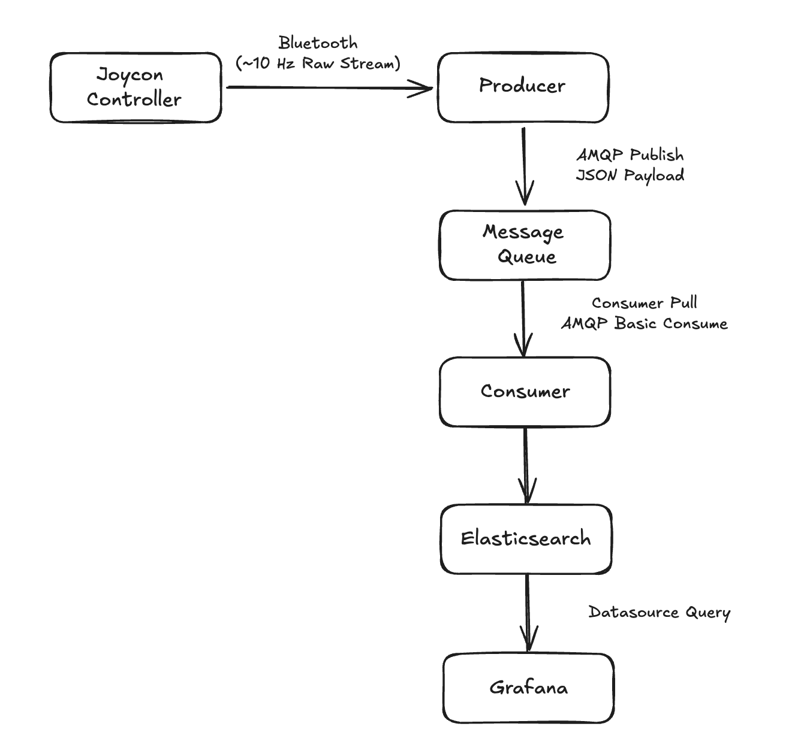
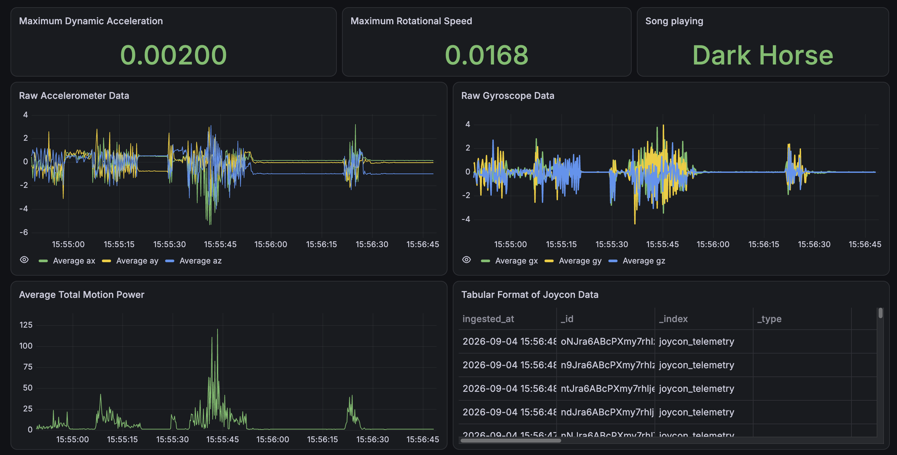
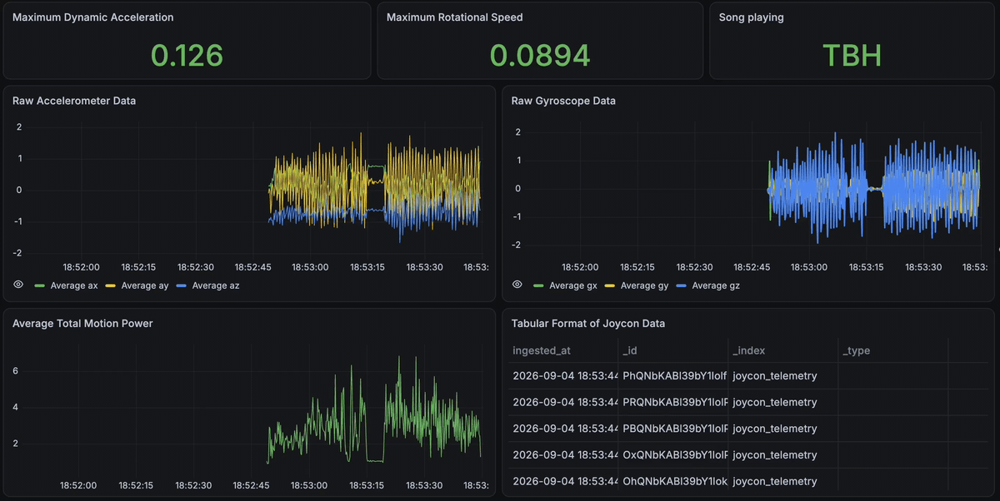

# 💃 Just Dance Real Time Motion Analytics ETL Pipeline 🕺

A real-time ETL pipeline that turns a Nintendo Switch Joy-Con into a motion sensor for dance sessions. Raw accelerometer and gyroscope readings are streamed off the controller, enriched with derived motion metrics, queued through RabbitMQ, indexed into Elasticsearch, and visualised live in Grafana.

**Tech stack:** Python (`pyjoycon`, `pika`, `elasticsearch-py`) · RabbitMQ · Elasticsearch · Grafana · Docker Compose

## Overview

Dancing with a Joy-Con in hand produces a constant stream of six-axis motion data. On its own that data says nothing about how energetically you actually moved. This project builds the pipeline that closes the gap.

The producer ([etl/producer.py](etl/producer.py)) reads the controller and derives motion features from every sample. The consumer ([etl/consumer.py](etl/consumer.py)) drains the queue into Elasticsearch. Grafana renders the session as it happens.

RabbitMQ sits in the middle on purpose. It decouples sampling from indexing, so a slow write never stalls data capture. The whole stack comes up with a single `docker compose up`.

## How it Works



**1. Capture.** The producer connects to the Joy-Con over Bluetooth HID. It samples the controller status roughly ten times a second.

**2. Transform.** Raw sensor counts are scaled down into usable units. [etl/features.py](etl/features.py) then derives three metrics from each sample. Dynamic acceleration (`la`) measures movement with gravity removed. Rotational speed (`rs`) measures how fast the controller is turning. Total motion power (`tp`) combines both into one intensity figure.

**3. Publish.** The producer sends each payload to RabbitMQ as JSON over AMQP. Messages are marked persistent. The queue is durable, so nothing is lost on a broker restart.

**4. Consume.** The consumer pulls messages off the queue in its own container. Each reading is indexed into the `joycon_telemetry` index in Elasticsearch. The index mapping is created on the first run. An `ingested_at` timestamp records when the document landed.

**5. Visualise.** Grafana queries Elasticsearch through a provisioned datasource. The dashboard definition lives in [grafana/](grafana/), so a fresh volume still comes up configured.



The dashboard tracks the session live. Stat panels show peak dynamic acceleration, peak rotational speed and the current song. Time series panels plot the raw accelerometer and gyroscope axes. The motion power chart makes the choreography readable at a glance, with quiet stretches between the spikes of the busier moves.

## How to Run

**Prerequisites:** Docker Desktop, Python 3.11+, and a Joy-Con paired to your machine over Bluetooth.

**1. Set your credentials.**

```bash
cp .env.example .env
```

Edit `.env` and pick a RabbitMQ username and password. Leave the Elasticsearch fields as they are.

**2. Start the stack.**

```bash
docker compose up -d --build
```

This brings up RabbitMQ, Elasticsearch, Grafana and the consumer. Give it a minute to pass its health checks.

**3. Run the producer on your host.**

The producer needs direct Bluetooth HID access, so it stays outside Docker.

```bash
python3 -m venv motion_venv
source motion_venv/bin/activate
pip install -r requirements.txt
python etl/producer.py
```

Enter a song name when prompted. Data starts flowing right away.

**4. Watch it live.**

| Service       | URL                    | Notes                                                                |
| ------------- | ---------------------- | -------------------------------------------------------------------- |
| Grafana       | http://localhost:3000  | Log in with `admin` / `admin`. The dashboard is already provisioned. |
| RabbitMQ      | http://localhost:15672 | Use the credentials from your `.env`.                                |
| Elasticsearch | http://localhost:9200  | Query the `joycon_telemetry` index directly.                         |

**5. Shut down.**

Stop the producer with `Ctrl+C`. Then tear down the containers.

```bash
docker compose down
```

Add `-v` to that command to wipe the stored data as well.

**TO NOTE:** You ned a Nintendo JoyCon to test out...If you don't have one, see how it runs below!



The dashboard filling up over a live session. The full quality recording is at [assets/demo.mp4](assets/demo.mp4).

## Challenges and Future Improvements

**Settling on the system design.** The hardest part came before any code. A Joy-Con emits a raw sensor stream with no notion of a session, a song or an intensity. Deciding where each responsibility belonged took a few false starts. Feature engineering ended up in the producer so that only finished payloads travel the wire. The broker sits between capture and storage so neither side blocks the other. Grafana reads straight from Elasticsearch instead of a bespoke API.

**Consumer lag under load.** The first version sampled the controller every millisecond. The consumer indexed one document at a time into Elasticsearch. Writes could not keep pace with reads, so the queue grew without bound. The dashboard drifted further behind the dancer as the session went on. Three changes fixed it. The producer now samples at a steady 10 Hz, which is plenty for human movement. The consumer purges stale messages on startup so an old backlog never replays. Timestamps moved to UTC ISO-8601 so Grafana lines events up on a real time axis.

**Predicting gold star moves.** The plan was to train an Isolation Forest on the motion features to flag the bursts that Just Dance scores as gold stars. Those moves are rare and sharp, which suits anomaly detection well. The compute cost was the blocker. Fitting the model over a full session on a laptop that is already running Elasticsearch, Grafana and a live capture loop is not realistic. Scoring in the pipeline would add latency to the exact path this project spent its time tightening. It stays on the list for a future run on dedicated hardware.
